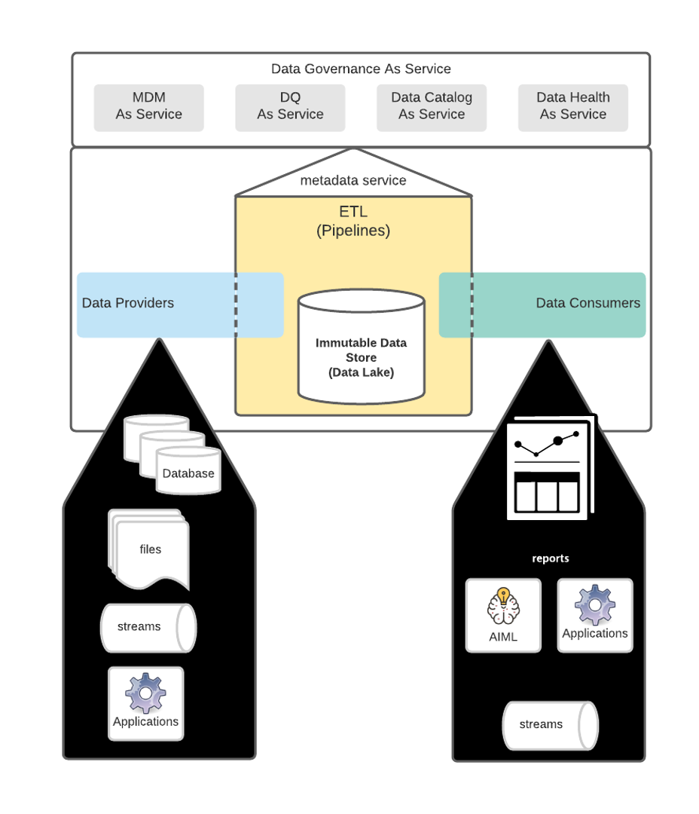
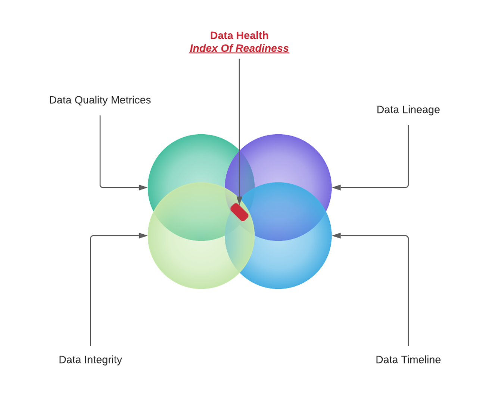
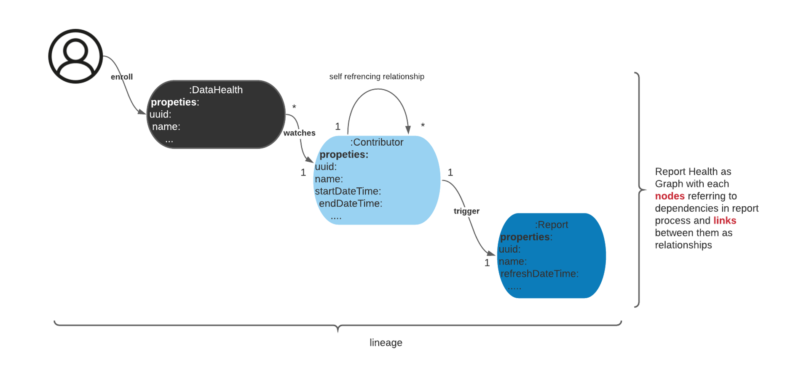
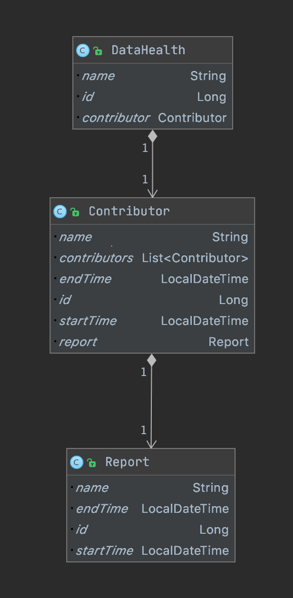
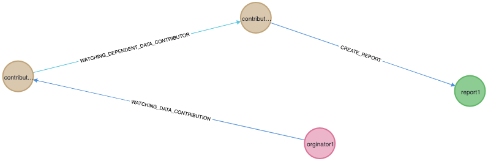

# Data Health As Service Using Graph DB

In this blog I will explore design/implementation of "**Health Of The Data**" by designing & building - "**_Data Health As Service_**" which finds the health of data from various contributors using graph inferencing.
Let's start our journet by understanding a modern data platform architecture.
## Modern Data Platform Architecture
The below picture shows Modern Data Platform architecture:

_The above architecture shows various key components/services of the "Data Platform Architecture". In this blog, we will be looking in "Data Health Service" and components/services required for it function._

## Context
The prime goal of data in data platform is to enable data driven decision using reports. The quality of the reports build using data, at broad level dependent on:
- Quality of data
- Timeliness of data
- Data lineage
- ...

Since quality of the data depends on various factors, I would like to propose a service/component in the design called _**"Data Health As Service"**_. This service will derive the health of the data from following key components:
- Data Quality as service
- ETL pipeline metadata service (pipeline context metadata)
- ...

Hence in nut shell, "Data Health As Service" will provide "Index Of Readiness" of data as show below:

## Index Of Readiness
As the saying goes - **_"Data is Gold"_**. A good jeweller will tell you, before buying the gold, double/triple check the quality. The quality of the gold is measured in "carats". The value of "carats" governs the cost of the gold. For example, 24 carat gold is expensive then 22 carat and so on.
The same applies to data as well.
The **"index of readiness of data"** is calculated as:

**_Index Of Readiness = 1 / sum (score  metrics influencing data quality) + score (data lineage) + score (data integrity)_**

_**If the index of readiness is closer to "zero", this implies that data is healthy.**_

So mathematically, we can drive health of the data using **_"Index Of Readiness"_**. In real world scenario, _**it's hard to get all the parameter which affects the health of the data**_.

A million dollar question, how can we derive "data health sense", from the metadata non mathematically.

## Data Health Using Graph DB

Graph databases are powerful in deducing connection between data (no matter what type data). Hence, I would like to propose the usage of graph database to derive health of the data. _How would the graph model look like, to develop such a service?_

## Data Health Graph Model

The following diagram shows the design of graph model for data health deduciton:

#### DataHeath
   The starting point the "Data Health Service". Its responsibility is to enroll data contributors which are contributing to final report/outcome or DQ metrices etc.
#### Contributor
   This is responsible for capturing information affecting final report. An example of _**Contributor**_ is an ETL pipeline.
#### Report
   This is a final node in the graph. A typical example, can be a cube or batch report etc.
   

## Data Heath Entities UML Class Diagram

Below diagram shows the data health entities class diagram:

## Data Health Output
The graph db output looks like below:

## Conclusion

Using above graph depiction it's very easy to deduce the health of data. If any of link from the **_"contributor/or report"_**  is missing, this will directly **_imply health is unhealthy_**. This is great way to find the health of data as graph based approach allows iterative addition of data health influencing metrices.

## How to Run?
Data As Service is build using:
- Java 14
- Spring Boot 2.3.3
- Neo4j
- Spring data neo4j

Below are steps to run this service:
- Run neo4j docker
- Run the DataHealthServiceApplicaiton

### Reference Documentation
For further reference, please consider the following sections:

* [Official Apache Maven documentation](https://maven.apache.org/guides/index.html)
* [Spring Boot Maven Plugin Reference Guide](https://docs.spring.io/spring-boot/docs/2.3.3.RELEASE/maven-plugin/reference/html/)
* [Create an OCI image](https://docs.spring.io/spring-boot/docs/2.3.3.RELEASE/maven-plugin/reference/html/#build-image)
* [Spring Web](https://docs.spring.io/spring-boot/docs/2.3.3.RELEASE/reference/htmlsingle/#boot-features-developing-web-applications)
* [Spring Data Neo4j](https://spring.io/projects/spring-data-neo4j)

### Guides
The following guides illustrate how to use some features concretely:

* [Building a RESTful Web Service](https://spring.io/guides/gs/rest-service/)
* [Serving Web Content with Spring MVC](https://spring.io/guides/gs/serving-web-content/)
* [Building REST services with Spring](https://spring.io/guides/tutorials/bookmarks/)

